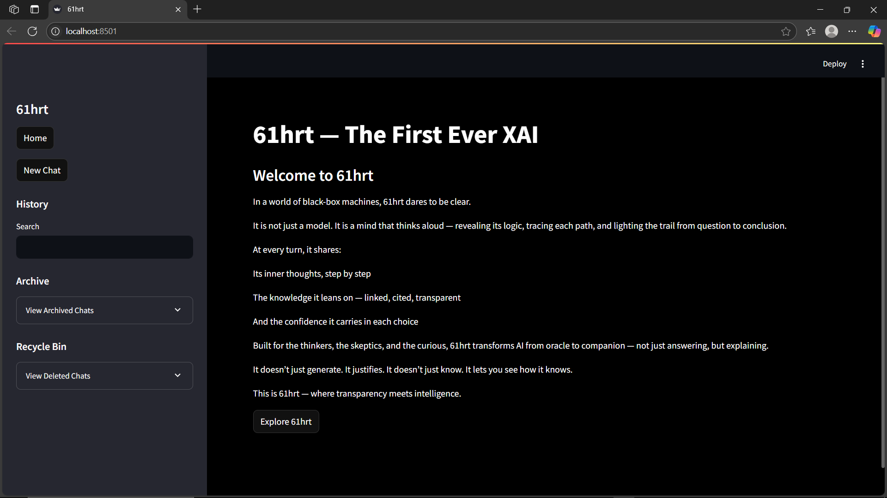
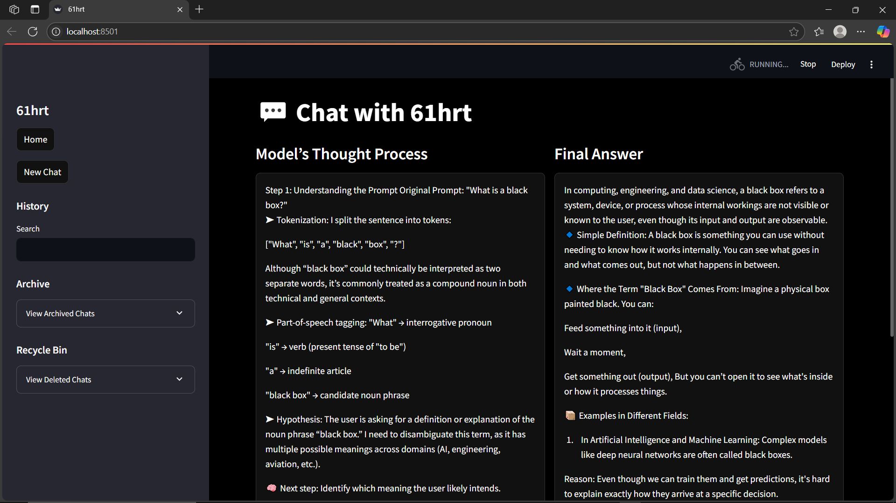

<div align="center">
  
  <h1 style="font-size: 3rem;">🧠 61hrt — The First Transparent AI Interface</h1>
  <p><em>“If LLMs could think out loud... this is what it would look like.”</em></p>
</div>

---

## 📜 Overview

Most LLMs today are **black boxes** — you ask a question, and they return an answer.  
No reasoning. No source. No trust.

**61hrt flips that script.**  
It’s a sleek, lightweight, fully transparent AI interface that explains *exactly how* it thinks — step by step, with citations and confidence scores.

> 💡 Built using Streamlit + Perplexity Sonar API  
> 🎓 Designed for researchers, students, and devs who crave explainability

---

## 🔍 Why 61hrt?

> “Can I trust this model?”  
> “Where did it get that info?”  
> “What’s the logic behind this answer?”

61hrt answers all of that. It shows you:
- 💡 **Thought process** – broken down step-by-step  
- 🔗 **Source links** – so you can verify  
- 📊 **Confidence levels** – to measure certainty  
- ✅ **Final answer** – after thinking

🧠 You don’t just get a response — you get reasoning.

---

## ⚙️ Features

| ✨ Feature | 🔎 Description |
|-----------|----------------|
| 🧩 **Explainable Reasoning** | See how the model breaks down queries like a human would |
| 🔗 **Source Transparency** | Links to real web sources, fully cited |
| 🎯 **Confidence Estimates** | Shows how sure the model is at every reasoning step |
| 💬 **Final Answer Block** | Summarized, separated answer for clarity |
| 🎨 **Custom Monochrome UI** | Sharp, minimal, CSS-powered Streamlit layout |
| 🗂️ **Memory Management** | Sidebar includes Archive, Recycle Bin, and Chat History |

---

## 📸 Screenshots

<p align="center">
  
  <br><em>🔲 Minimal welcome screen — clean, sharp, and focused</em>
</p>

<p align="center">
  
  <br><em>🧠 Transparent AI in action — explanations, sources, and certainty</em>
</p>

---

## 🛠️ Built With

- 🖼️ [Streamlit](https://streamlit.io) — for the web interface  
- 🔍 [Perplexity Sonar API](https://labs.perplexity.ai) — as the model backend  
- 🐍 Python 3.8+  
- 💅 Markdown + custom HTML/CSS

---

## 🚀 Run It Yourself

```bash
# 1. Clone this repo
git clone https://github.com/your-username/61hrt.git
cd 61hrt

# 2. Install required packages
pip install streamlit requests

# 3. Add your Perplexity API key
# In your Python file (e.g. LLM.py), update:
API_KEY = "your-perplexity-api-key-here"

# 4. Launch the app
streamlit run LLM.py


